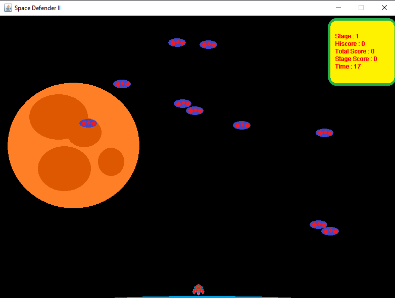
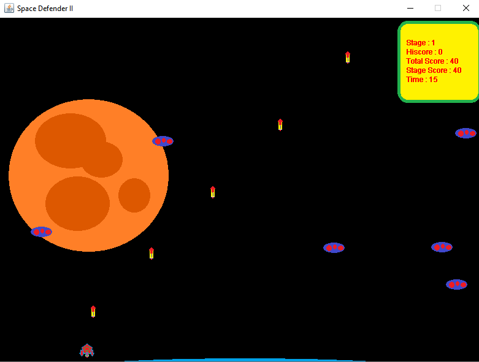

Space Defender II [ Space Invaders Rip-Off ]
=

The first Java project that I ever did (University of Thessaly 2014).

<b>No source-code changes/improvements will be made by me</b>. This is my work from 2014, 
and I want to preserve it as it once was. However, building a java project from scratch became 
unpopular in the last few years, so I've added maven. You spoiled kids can build the project with
one simple command or import it to your intellij and press the 'Play' button.

Build and run instructions:

    $ mvn package
    $ java -jar target/javaspacegame-1.0-SNAPSHOT.jar

I used jdk8 no idea if it works for newer versions... good luck.

FAQ
-

Who created these beautiful sprites? I did it.

What did you use for the GUI? AWT and Swing

Preview
-

 
 

